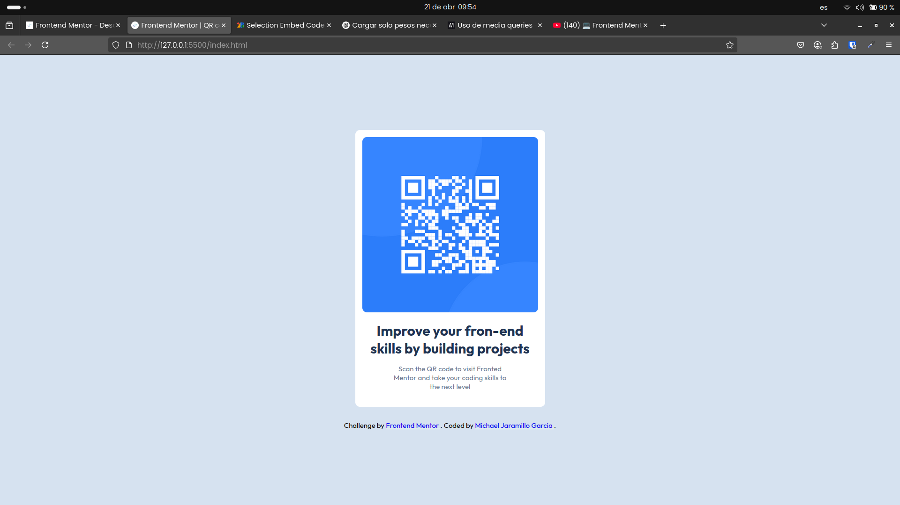
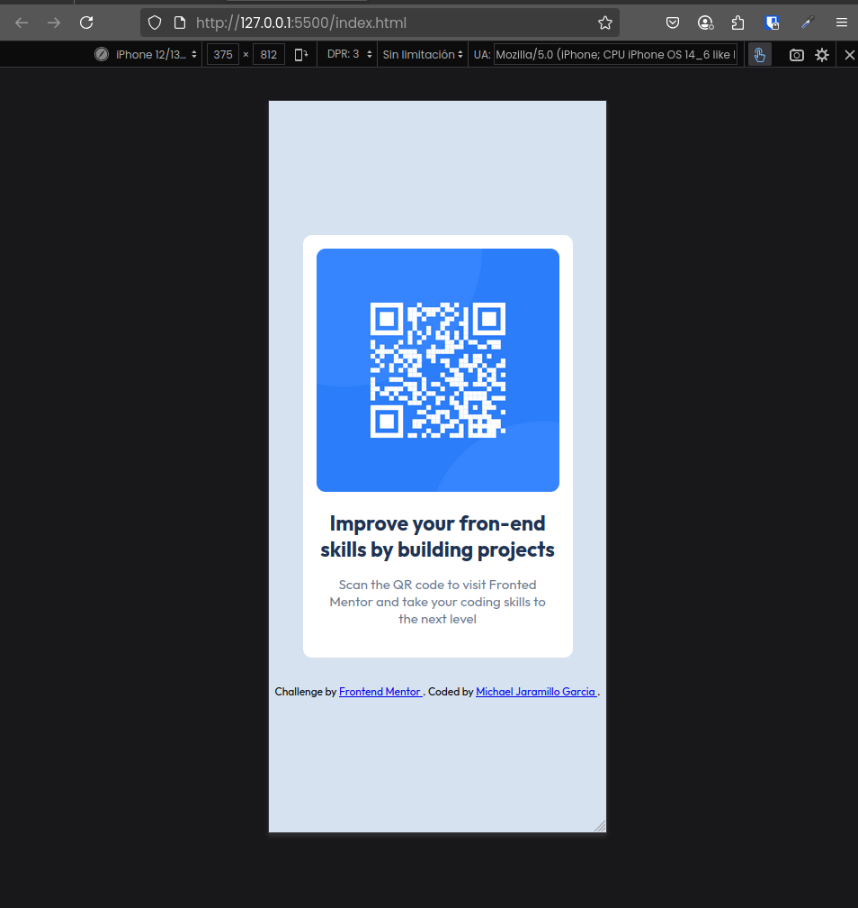

# Frontend Mentor - Solución al componente de código QR

Esta es una solución al [desafío del componente de código QR en Frontend Mentor](https://www.frontendmentor.io/challenges/qr-code-component-iux_sIO_H). Los retos de Frontend Mentor te ayudan a mejorar tus habilidades de programación construyendo proyectos realistas. 

## Resumen

### Captura de pantalla

### Enlaces

- URL de la solución: [https://github.com/MichaelJara905/QR-code-component.git]
- URL del sitio en vivo: [https://michaeljara905.github.io/QR-code-component/]

## My process

## 🔄 My Workflow

- Semantic HTML5 markup
- CSS custom properties
- Flexbox

### Lo que aprendí

    @media (max-width:500px) {

        .contenedor-principal {

            border-radius: 10px;
            width: 20rem;
            background-color: rgb(255, 255, 255);
        }
        
        .title{
            
            text-align: center;
            font-size: 23px;
            
        }

        .attribution {

            font-size: 12px;
        }

    }

Aprendi a utilizar  media queris para el diseño responsive.

### Desarrollo continuado

Quiero empezar a trabajar con React o Vue, y utilizar un framework de Css llamado Tailwindcss para futuros proyectos, aunque por ahora me voy a centrar en tener unas bases solidas.

### Recursos útiles

- [https://fonts.google.com/] - Muy buen sitio de descarga de fuentes y muy facil de aplicar.
- [https://developer.mozilla.org/es/docs/Web/CSS/CSS_media_queries/Using_media_queries] - Gracias a esta pagina pude entender y apropiarme de conocimientos para utilizar los media queris.

## Autor

- Frontend Mentor - [@MichaelJara905]
- Instagram - [@jaramillo_maicol_0]

## Agradecimientos

Tratemos de hacer los retos de la mejor manera posible, y no solo hacerlos porque si, sino tratar de entender que estamos realizando para apropiarnos del conocimiento.
